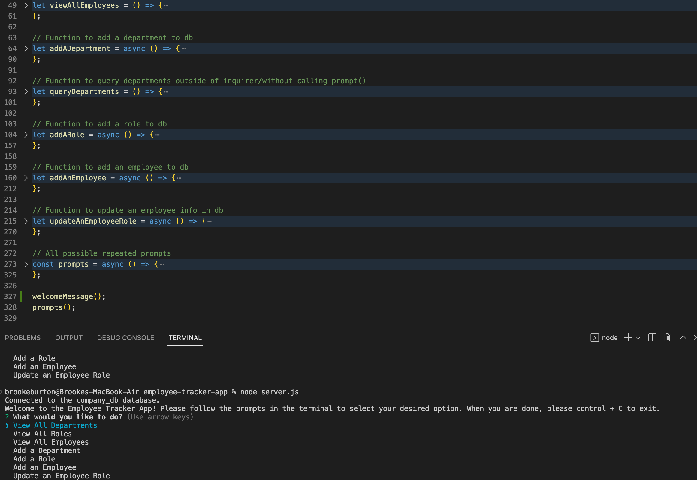

# Employee Tracker App

## This app was created in order to allow businesses to create, store, view and update an employee database via a command line interface. It is efficient and simple which allows for minimum effort/time to keep track of employees. On top of practicing all my software engineer skills, by working on this app i learned to use mySQL and how to integrate it with inquirer.

## Links

- Repository: https://github.com/bburton5/employee-tracker
- Walkthrough:

## Usage

## Credits

- StackOverflow
- MDN
- w3schools
- npm
